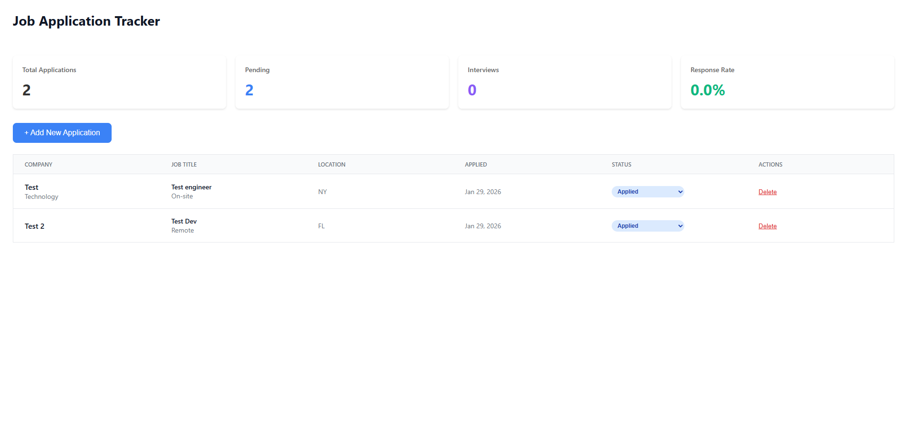

# Job Application Tracker

A full-stack web application for tracking job applications with real-time dashboard analytics.

## Features

- Track job applications with detailed information
- Real-time dashboard showing application statistics
- Update application status with dropdown selection
- Company management system
- Clean, responsive interface

## Tech Stack

**Frontend:**
- React (Vite)
- Axios for API requests

**Backend:**
- Node.js
- Express.js
- PostgreSQL database with optimized indexing

**Database Design:**
- Normalized relational schema
- Foreign key constraints with cascading deletes
- Strategic indexes on frequently queried columns

## Screenshots



## Setup Instructions

### Prerequisites
- Node.js v20+
- PostgreSQL v15+

### Installation

1. Clone repository
```bash
git clone https://github.com/YOUR-USERNAME/job-tracker.git
cd job-tracker
```

2. Set up database
```bash
psql -U postgres
CREATE DATABASE job_tracker;
\c job_tracker
\i backend/schema.sql
\q
```

3. Configure backend
```bash
cd backend
npm install
```

Create `backend/.env`:
```
DB_USER=postgres
DB_PASSWORD=yourpassword
DB_HOST=localhost
DB_PORT=5432
DB_NAME=job_tracker
PORT=5001
```

4. Configure frontend
```bash
cd ../frontend
npm install
```

5. Run application
```bash
# Terminal 1 - Backend
cd backend
npm run dev

# Terminal 2 - Frontend
cd frontend
npm run dev
```

Access at `http://localhost:5173`

## API Endpoints

- `GET /api/applications` - List all applications
- `POST /api/applications` - Create application
- `PATCH /api/applications/:id/status` - Update status
- `DELETE /api/applications/:id` - Delete application
- `GET /api/stats/overview` - Dashboard statistics

## Database Schema

The application uses a normalized PostgreSQL database with:
- **companies** table (one-to-many with applications)
- **applications** table (core application data)
- **interactions** table (timeline tracking)
- **contacts** table (recruiter information)

Strategic indexes on `application_status`, `application_date`, and `company_id` for optimized queries.

## Author

Luis Miranda - Computer Engineering Graduate  
Email: Luismiranda156@gmail.com  
